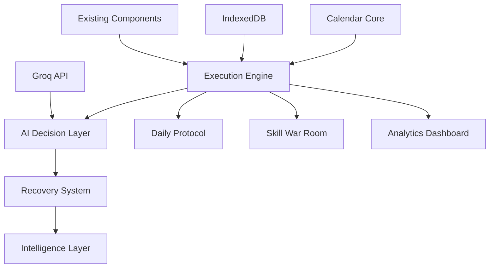

# Design Document

## Overview

AVION.EXE Intelligence Upgrade transforms the existing Command Center into a self-correcting execution engine with AI decision-making, live calendar awareness, and intelligent behavior change systems. The design maintains full backward compatibility while adding five intelligence layers that work together to create an adaptive, learning execution system.

## Architecture

### Core Architecture Principles
- **Layered Intelligence**: Each layer builds on the previous without breaking existing functionality
- **Event-Driven Updates**: Calendar changes, streak breaks, and performance shifts trigger intelligent responses
- **Graceful Degradation**: System continues operating even if AI services are unavailable
- **Data-Driven Decisions**: All AI recommendations based on comprehensive execution history

### System Components



## Components and Interfaces

### 1. Calendar Core
**Purpose**: Live date awareness and automatic daily resets

**Interface**:
```javascript
class CalendarCore {
  getCurrentDate(): Date
  getDayType(): 'exam' | 'normal' | 'holiday'
  getAcademicRelevance(): AcademicContext
  scheduleMiddnightReset(): void
  isToday(date: string): boolean
}
```

### 2. Execution Engine (Enhanced)
**Purpose**: Orchestrates daily execution with AI-powered focus

**Interface**:
```javascript
class ExecutionEngine {
  getPrimaryObjective(): DailyObjective
  updateExecutionState(completion: ExecutionUpdate): void
  triggerRecoveryMode(): void
  calculateMomentumScore(): number
  getEmergencyModeTasks(): Task[]
}
```

### 3. AI Decision Layer
**Purpose**: Groq-powered intelligent decision making

**Interface**:
```javascript
class AIDecisionLayer {
  selectDailyObjective(context: DailyContext): Promise<DailyObjective>
  analyzeWeeklyPerformance(data: WeeklyData): Promise<PerformanceAnalysis>
  generateSkillSyllabus(track: SkillTrack): Promise<WeeklySyllabus>
  decidePlacementReadiness(metrics: PlacementMetrics): Promise<ReadinessAnalysis>
  triggerRecoveryDecision(state: SystemState): Promise<RecoveryAction>
}
```

### 4. Recovery System
**Purpose**: Intelligent failure detection and response

**Interface**:
```javascript
class RecoverySystem {
  detectStreakBreak(): boolean
  detectBurnoutPattern(): boolean
  activateRecoveryMode(): void
  getSimplifiedTasks(): Task[]
  graduateFromRecovery(): boolean
}
```

### 5. Intelligence Layer
**Purpose**: Predictive analytics and learning optimization

**Interface**:
```javascript
class IntelligenceLayer {
  predictWeeklyPerformance(): PerformancePrediction
  optimizeScheduling(): ScheduleRecommendation
  correlatePlacementReadiness(): PlacementCorrelation
  learnFromBehavior(actions: UserAction[]): void
}
```

## Data Models

### DailyExecution Schema
```javascript
{
  id: string,                    // ISO date (YYYY-MM-DD)
  date: string,                  // ISO date string
  criticalBlocksCompleted: number,
  totalCriticalBlocks: number,
  timeSpentMinutes: number,
  emergencyModeUsed: boolean,
  streakStatus: 'maintained' | 'broken' | 'recovered',
  momentumScore: number,         // 0-100
  primaryObjective: {
    task: string,
    completed: boolean,
    aiConfidence: number
  },
  timestamp: string
}
```

### SkillProgress Schema
```javascript
{
  id: string,                    // trackType-weekNumber-taskId
  trackType: 'bash' | 'python' | 'ai_security',
  weekNumber: number,
  taskId: string,
  difficultyLevel: number,       // 1-10
  completionStatus: 'pending' | 'completed' | 'skipped',
  confidenceRating: number,      // 1-5 user self-assessment
  timeSpentMinutes: number,
  aiGenerated: boolean,
  adaptationReason: string,      // Why AI adjusted difficulty
  date: string,
  timestamp: string
}
```

### AI_Decisions Schema
```javascript
{
  id: string,
  date: string,
  decisionType: 'daily_objective' | 'weekly_analysis' | 'syllabus_generation' | 'recovery_trigger' | 'placement_readiness',
  inputSnapshot: {
    systemState: object,
    userContext: object,
    historicalData: object
  },
  outputResult: {
    decision: object,
    reasoning: string,
    alternatives: object[]
  },
  confidenceScore: number,       // 0-100
  executionTime: number,         // milliseconds
  groqModel: string,
  timestamp: string
}
```

### SystemState Schema
```javascript
{
  id: 'current',                 // singleton record
  currentStreak: number,
  longestStreak: number,
  momentumScore: number,         // 0-100
  recoveryMode: boolean,
  recoveryStartDate: string,
  lastActiveDate: string,
  placementReadinessScore: number,
  weeklyFocusArea: string,
  emergencyModeCount: number,    // this week
  aiDecisionCount: number,       // today
  lastMidnightReset: string,
  timestamp: string
}
```

### CalendarEvents Schema
```javascript
{
  id: string,
  date: string,
  eventType: 'exam' | 'deadline' | 'holiday' | 'break',
  title: string,
  priority: 'critical' | 'high' | 'medium' | 'low',
  academicRelevance: {
    subjectId: string,
    impactLevel: number,         // 1-10
    preparationDays: number
  },
  timestamp: string
}
```

## Correctness Properties

*A property is a characteristic or behavior that should hold true across all valid executions of a system-essentially, a formal statement about what the system should do. Properties serve as the bridge between human-readable specifications and machine-verifiable correctness guarantees.*

<function_calls>
<invoke name="prework">
<parameter name="featureName">avion-intelligence-upgrade

### Property Reflection

After analyzing all acceptance criteria, I identified several areas where properties can be consolidated for better test coverage:

**Consolidation Opportunities:**
- Properties 1.1, 1.2, and 1.4 can be combined into a comprehensive "System Stability During Upgrades" property
- Properties 4.1-4.5 can be consolidated into a "Data Schema Integrity" property that covers all persistence requirements
- Properties 7.1, 7.3, and 7.4 can be combined into a "Recovery System Behavior" property
- Properties 9.1, 9.3, and 9.5 can be merged into a "AI Decision Layer Completeness" property

**Final Property Set:**

Property 1: System Stability During Upgrades
*For any* system upgrade phase, the existing functionality should continue operating normally and rollback gracefully on failure without data loss
**Validates: Requirements 1.1, 1.2, 1.4**

Property 2: AI Daily Decision Consistency
*For any* daily context with deadlines and momentum data, the AI Decision Layer should always return exactly one primary objective with reasoning
**Validates: Requirements 2.1**

Property 3: AI Performance Analysis Completeness
*For any* weekly performance data, the AI should generate analysis with performance verdict, weakest area identification, and focus recommendations
**Validates: Requirements 2.2**

Property 4: Adaptive Curriculum Generation
*For any* skill track showing stagnation patterns, the AI should generate 2-4 weeks of adaptive curriculum with appropriate difficulty adjustments
**Validates: Requirements 2.3**

Property 5: Automatic Recovery Activation
*For any* streak break detection, the Recovery System should automatically activate with 50% complexity reduction and simplified objectives
**Validates: Requirements 2.4, 7.1, 7.3**

Property 6: Placement Readiness Explanations
*For any* placement readiness score change, the AI should provide human-readable explanations with exactly 2 concrete next actions
**Validates: Requirements 2.5**

Property 7: Calendar Date Accuracy
*For any* system component displaying dates, the current date and day of week should always be accurate and today should be highlighted
**Validates: Requirements 3.1, 3.3**

Property 8: Midnight Reset Behavior
*For any* midnight transition, the system should automatically reset daily states and update all calendar-aware displays
**Validates: Requirements 3.2, 3.4**

Property 9: Timezone Handling
*For any* timezone change or DST transition, the system should maintain accurate time awareness without data corruption
**Validates: Requirements 3.5**

Property 10: Data Schema Integrity
*For any* data operation (store/retrieve), all schemas should maintain JSON compatibility, IndexedDB functionality, and complete data persistence
**Validates: Requirements 4.1, 4.2, 4.3, 4.4, 4.5**

Property 11: Primary Objective Display
*For any* application startup, exactly one primary objective should be displayed with clear progress indicators
**Validates: Requirements 5.1, 5.2**

Property 12: AI Prioritization Logic
*For any* set of competing tasks, the AI should prioritize based on measurable impact and urgency criteria
**Validates: Requirements 5.3**

Property 13: Emergency Mode Behavior
*For any* emergency mode activation, task complexity should be reduced by exactly 50% while maintaining core functionality
**Validates: Requirements 5.4**

Property 14: Momentum Score Influence
*For any* momentum score change, daily recommendations should reflect the change in a measurable way
**Validates: Requirements 5.5**

Property 15: Academic-Skill Coupling
*For any* approaching academic deadline, skill track difficulty and time allocation should adjust proportionally to deadline proximity
**Validates: Requirements 6.1, 6.4**

Property 16: Placement Readiness Correlation
*For any* skill and academic progress data, the system should calculate meaningful correlations for placement readiness scoring
**Validates: Requirements 6.2**

Property 17: Intelligent Skill Recommendations
*For any* lagging placement-core subject, the AI should recommend skill tracks that directly reinforce the academic concepts
**Validates: Requirements 6.3**

Property 18: Integrated Study Plan Generation
*For any* study plan request, the output should combine both coding practice and theoretical learning in a structured format
**Validates: Requirements 6.5**

Property 19: Recovery System Progression
*For any* consistency return pattern, the Recovery System should gradually increase difficulty at appropriate intervals
**Validates: Requirements 7.4**

Property 20: Recovery Escalation
*For any* multiple recovery trigger scenario, the system should escalate to emergency protocols with appropriate safeguards
**Validates: Requirements 7.5**

Property 21: Performance Prediction Accuracy
*For any* current trajectory data, weekly performance predictions should be within reasonable accuracy bounds
**Validates: Requirements 8.1**

Property 22: Productivity Pattern Recognition
*For any* productivity data set, the system should identify meaningful patterns and suggest optimal scheduling adjustments
**Validates: Requirements 8.2**

Property 23: Intervention Recommendations
*For any* declining performance trend, the system should recommend specific, actionable interventions
**Validates: Requirements 8.3**

Property 24: Placement Readiness Forecasting
*For any* readiness metrics, forecasts should highlight critical improvement areas with specific guidance
**Validates: Requirements 8.4**

Property 25: Behavioral Learning
*For any* user behavior data over time, prediction accuracy should demonstrably improve through learning
**Validates: Requirements 8.5**

Property 26: AI Decision Layer Completeness
*For any* AI decision request, the system should use Groq API, include confidence scores, log decisions, and fallback gracefully on API failure
**Validates: Requirements 9.1, 9.3, 9.5**

Property 27: Decision Context Consideration
*For any* AI decision, current date, pending tasks, and momentum status should be included in the decision context
**Validates: Requirements 9.2**

Property 28: API Fallback Behavior
*For any* Groq API failure, the system should seamlessly fallback to rule-based decision making without user disruption
**Validates: Requirements 9.4**

Property 29: State Persistence Integrity
*For any* system state change, data should be immediately persisted to IndexedDB and fully restorable on restart
**Validates: Requirements 10.1, 10.2**

Property 30: Data Recovery and Validation
*For any* data corruption or inconsistency, the system should recover from backups and repair issues automatically
**Validates: Requirements 10.3, 10.5**

Property 31: System Export Completeness
*For any* export operation, the complete system state should be exportable and importable without data loss
**Validates: Requirements 10.4**

## Upgrade Roadmap

### Phase 1: Calendar Core & Date Awareness (Risk: Low)
**Goal**: Establish live calendar system and automatic daily resets

**Features Added**:
- CalendarCore class with timezone awareness
- Automatic midnight reset mechanism
- Today highlighting across all components
- Academic calendar integration

**Dependencies**: None (pure addition)

**Data Changes**:
- Add CalendarEvents schema to IndexedDB
- Add lastMidnightReset to SystemState
- Enhance existing components with date awareness

**Implementation Steps**:
1. Create CalendarCore utility class
2. Add calendar event storage schema
3. Implement midnight reset scheduler
4. Update all components to use CalendarCore
5. Add today highlighting to existing UI

### Phase 2: Enhanced Data Schemas (Risk: Low)
**Goal**: Extend IndexedDB with intelligence-ready data structures

**Features Added**:
- DailyExecution tracking schema
- Enhanced SkillProgress with AI fields
- AI_Decisions logging schema
- SystemState management

**Dependencies**: Phase 1 (Calendar Core)

**Data Changes**:
- Add 4 new IndexedDB object stores
- Migrate existing data to enhanced schemas
- Add data validation and integrity checks

**Implementation Steps**:
1. Design and validate new schemas
2. Create database migration utilities
3. Implement new data access methods
4. Add data integrity validation
5. Test migration with existing data

### Phase 3: AI Decision Layer (Risk: Medium)
**Goal**: Integrate Groq API for intelligent decision making

**Features Added**:
- AIDecisionLayer class with Groq integration
- Daily objective selection
- Weekly performance analysis
- Skill syllabus generation
- Placement readiness analysis

**Dependencies**: Phase 2 (Data Schemas)

**Data Changes**:
- Start logging AI decisions
- Store confidence scores and reasoning
- Track API usage and fallback events

**Implementation Steps**:
1. Create AIDecisionLayer class
2. Implement Groq API integration
3. Add fallback rule-based logic
4. Create decision logging system
5. Integrate with existing components

### Phase 4: Recovery & Consistency Systems (Risk: Medium)
**Goal**: Intelligent failure detection and recovery mechanisms

**Features Added**:
- RecoverySystem class
- Streak break detection
- Burnout pattern recognition
- Emergency mode protocols
- Gradual difficulty adjustment

**Dependencies**: Phase 3 (AI Decision Layer)

**Data Changes**:
- Track recovery events and outcomes
- Store burnout indicators
- Log emergency mode usage

**Implementation Steps**:
1. Create RecoverySystem class
2. Implement streak and burnout detection
3. Add emergency mode task generation
4. Create gradual recovery mechanisms
5. Integrate with AI decision layer

### Phase 5: Intelligence & Prediction Layer (Risk: High)
**Goal**: Advanced analytics, learning, and prediction capabilities

**Features Added**:
- IntelligenceLayer class
- Performance prediction algorithms
- Behavioral learning system
- Academic-skill coupling logic
- Optimization recommendations

**Dependencies**: Phase 4 (Recovery Systems)

**Data Changes**:
- Store prediction accuracy metrics
- Track learning improvements
- Log optimization outcomes

**Implementation Steps**:
1. Create IntelligenceLayer class
2. Implement prediction algorithms
3. Add behavioral learning logic
4. Create academic-skill coupling
5. Build optimization engine

## Groq Prompts (Production-Ready)

### 1️⃣ Daily Primary Objective Selector

```
SYSTEM: You are AVION.EXE's Daily Objective Selector. Your job is to analyze the user's current context and select exactly ONE most important task for today.

CONTEXT:
- Current Date: {currentDate}
- Day of Week: {dayOfWeek}
- Academic Calendar: {academicEvents}
- Current Streak: {currentStreak} days
- Momentum Score: {momentumScore}/100
- Recovery Mode: {recoveryMode}

PENDING TASKS:
{pendingTasks}

RECENT PERFORMANCE:
{recentPerformance}

INSTRUCTIONS:
1. Consider deadline proximity (weight: 40%)
2. Consider streak risk if skipped (weight: 30%)
3. Consider momentum impact (weight: 20%)
4. Consider placement readiness impact (weight: 10%)

OUTPUT FORMAT (JSON):
{
  "primaryObjective": "Single, specific task description",
  "reasoning": "2-3 sentence explanation of why this task is most critical today",
  "urgencyScore": 1-10,
  "impactScore": 1-10,
  "confidenceLevel": 1-100
}

RULES:
- Select exactly ONE task
- Be specific and actionable
- Consider user's current mental state
- Prioritize placement-critical work
- Account for recovery mode if active
```

### 2️⃣ Weekly Performance Analyzer

```
SYSTEM: You are AVION.EXE's Weekly Performance Analyzer. Analyze the last 7 days and provide strategic adjustments.

WEEKLY DATA:
- Dates: {weekStartDate} to {weekEndDate}
- Daily Completions: {dailyCompletions}
- Time Spent: {timeSpentData}
- Streak Events: {streakEvents}
- Emergency Mode Usage: {emergencyModeCount}
- Skill Progress: {skillProgressData}
- Academic Progress: {academicProgressData}

PERFORMANCE METRICS:
- Overall Completion Rate: {completionRate}%
- Average Daily Time: {avgDailyTime} minutes
- Consistency Score: {consistencyScore}/100
- Difficulty Ratings: {difficultyRatings}

INSTRUCTIONS:
Analyze patterns in:
1. Completion consistency
2. Time management efficiency
3. Difficulty vs performance correlation
4. Burnout indicators
5. Skill-academic balance

OUTPUT FORMAT (JSON):
{
  "performanceVerdict": "excellent|good|concerning|critical",
  "overallScore": 1-100,
  "weakestArea": "Specific area needing attention",
  "strongestArea": "Area performing well",
  "focusShiftRecommendation": "Specific adjustment for next week",
  "difficultyAdjustment": "increase|maintain|decrease",
  "burnoutRisk": 1-10,
  "confidenceLevel": 1-100
}

RULES:
- Be honest about performance gaps
- Provide actionable recommendations
- Consider sustainable pace
- Balance challenge with achievability
```

### 3️⃣ Auto Syllabus Generator (Skills)

```
SYSTEM: You are AVION.EXE's Adaptive Skill Syllabus Generator. Create the next 2-4 weeks of skill development based on performance data.

SKILL TRACK: {trackType} (bash|python|ai_security)
CURRENT WEEK: {currentWeek}
PERFORMANCE HISTORY:
{performanceHistory}

USER CONTEXT:
- Current Difficulty Level: {currentDifficulty}/10
- Recent Completion Rate: {recentCompletionRate}%
- Confidence Ratings: {confidenceRatings}
- Time Constraints: {timeConstraints}
- Academic Deadlines: {upcomingDeadlines}

ADAPTATION TRIGGERS:
- Stagnation Detected: {stagnationDetected}
- Overload Detected: {overloadDetected}
- Rapid Progress: {rapidProgress}

INSTRUCTIONS:
Generate 2-4 weeks of progressive curriculum that:
1. Adapts difficulty based on recent performance
2. Includes emergency-mode fallback tasks (50% complexity)
3. Aligns with academic timeline
4. Builds on previous concepts
5. Includes practical projects

OUTPUT FORMAT (JSON):
{
  "weeks": [
    {
      "weekNumber": number,
      "difficultyLevel": 1-10,
      "focusArea": "Primary skill focus",
      "dailyTasks": [
        {
          "day": "monday|tuesday|...",
          "task": "Specific task description",
          "estimatedTime": minutes,
          "difficulty": 1-10,
          "emergencyFallback": "Simplified version"
        }
      ],
      "weeklyProject": "Hands-on project description",
      "learningObjectives": ["objective1", "objective2"]
    }
  ],
  "adaptationReasoning": "Why this curriculum fits current performance",
  "confidenceLevel": 1-100
}

RULES:
- Ensure progressive difficulty
- Include practical applications
- Provide emergency alternatives
- Consider time constraints
- Build transferable skills
```

### 4️⃣ Recovery Mode Trigger

```
SYSTEM: You are AVION.EXE's Recovery System. Detect when the user needs simplified execution and provide appropriate interventions.

CURRENT STATE:
- Current Date: {currentDate}
- Streak Status: {streakStatus}
- Days Since Last Activity: {daysSinceActivity}
- Recent Completion Rates: {recentCompletions}
- Emergency Mode Usage: {emergencyModeCount} (this week)
- Momentum Score: {momentumScore}/100
- Burnout Indicators: {burnoutIndicators}

PERFORMANCE PATTERNS:
{performancePatterns}

STRESS INDICATORS:
- Academic Pressure: {academicPressure}/10
- Deadline Proximity: {deadlineProximity}
- Workload Level: {workloadLevel}/10

INSTRUCTIONS:
Analyze if recovery mode should be:
1. ACTIVATED - User needs simplified tasks
2. MAINTAINED - Continue current recovery
3. GRADUATED - Ready to increase difficulty
4. EMERGENCY - Critical intervention needed

OUTPUT FORMAT (JSON):
{
  "recoveryDecision": "activate|maintain|graduate|emergency",
  "reasoning": "Clear explanation of decision factors",
  "recommendedDuration": "days",
  "simplifiedTasks": [
    {
      "task": "Minimal viable task",
      "timeRequired": minutes,
      "successCriteria": "Clear completion criteria"
    }
  ],
  "graduationCriteria": "What needs to happen to exit recovery",
  "urgencyLevel": 1-10,
  "confidenceLevel": 1-100
}

RULES:
- Prioritize user wellbeing
- Provide achievable tasks
- Clear graduation path
- Prevent complete disengagement
- Maintain momentum where possible
```

### 5️⃣ Placement Readiness Decision

```
SYSTEM: You are AVION.EXE's Placement Readiness Analyzer. Explain readiness changes and provide concrete next actions.

CURRENT METRICS:
- Overall Readiness Score: {currentScore}/100
- Previous Score: {previousScore}/100
- Change: {scoreChange}
- Academic Progress: {academicProgress}
- Skill Development: {skillProgress}
- Coding Practice: {codingPractice}
- Project Portfolio: {projectPortfolio}

SUBJECT BREAKDOWN:
- DAA (30% weight): {daaProgress}%
- Java (25% weight): {javaProgress}%
- Competitive Coding (20% weight): {codingProgress}%
- Full Stack (15% weight): {fullStackProgress}%
- Other Subjects (10% weight): {otherProgress}%

TIMELINE CONTEXT:
- Days to Placement Season: {daysToPlacement}
- Upcoming Exams: {upcomingExams}
- Project Deadlines: {projectDeadlines}

INSTRUCTIONS:
Provide clear explanation of:
1. Why the score changed
2. What factors contributed most
3. Specific areas needing attention
4. Concrete next actions

OUTPUT FORMAT (JSON):
{
  "readinessExplanation": "Human-readable explanation of current readiness and recent changes",
  "primaryFactors": [
    {
      "factor": "Specific factor name",
      "impact": "positive|negative",
      "magnitude": 1-10,
      "description": "How this factor affected readiness"
    }
  ],
  "nextActions": [
    {
      "action": "Specific, actionable task",
      "priority": "critical|high|medium",
      "timeframe": "Complete by when",
      "expectedImpact": "How this will improve readiness"
    }
  ],
  "trajectoryForecast": "Where you'll be in 4 weeks if current pace continues",
  "confidenceLevel": 1-100
}

RULES:
- Provide exactly 2 concrete next actions
- Be specific and actionable
- Consider timeline constraints
- Focus on highest-impact improvements
- Maintain realistic expectations
```

## Calendar & Date Logic Design

### Date Utility Logic

```javascript
class CalendarCore {
  constructor() {
    this.timezone = Intl.DateTimeFormat().resolvedOptions().timeZone
    this.midnightResetScheduled = false
  }

  getCurrentDate() {
    return new Date()
  }

  getTodayString() {
    return new Date().toISOString().split('T')[0]
  }

  getDayOfWeek() {
    return new Date().toLocaleDateString('en-US', { weekday: 'long' })
  }

  getDayType(date = new Date()) {
    // Check against academic calendar
    const dateStr = date.toISOString().split('T')[0]
    const event = this.getAcademicEvent(dateStr)
    
    if (event) {
      return event.eventType // 'exam', 'deadline', 'holiday'
    }
    
    // Check if weekend
    const dayOfWeek = date.getDay()
    if (dayOfWeek === 0 || dayOfWeek === 6) {
      return 'weekend'
    }
    
    return 'normal'
  }

  getAcademicRelevance(date = new Date()) {
    const dateStr = date.toISOString().split('T')[0]
    const events = this.getUpcomingEvents(dateStr, 7) // Next 7 days
    
    return {
      hasUpcomingExam: events.some(e => e.eventType === 'exam'),
      hasUpcomingDeadline: events.some(e => e.eventType === 'deadline'),
      daysToNextCritical: this.getDaysToNextCritical(dateStr),
      urgencyLevel: this.calculateUrgencyLevel(events)
    }
  }

  scheduleMidnightReset() {
    if (this.midnightResetScheduled) return

    const now = new Date()
    const tomorrow = new Date(now)
    tomorrow.setDate(tomorrow.getDate() + 1)
    tomorrow.setHours(0, 0, 0, 0)
    
    const msUntilMidnight = tomorrow.getTime() - now.getTime()
    
    setTimeout(() => {
      this.performMidnightReset()
      this.scheduleMidnightReset() // Schedule next reset
    }, msUntilMidnight)
    
    this.midnightResetScheduled = true
  }

  async performMidnightReset() {
    try {
      // Reset daily states
      await this.resetDailyStates()
      
      // Update system state
      await this.updateSystemState()
      
      // Trigger UI updates
      this.broadcastDateChange()
      
      console.log('Midnight reset completed:', this.getTodayString())
    } catch (error) {
      console.error('Midnight reset failed:', error)
    }
  }

  isToday(dateString) {
    return dateString === this.getTodayString()
  }

  formatDateForDisplay(date) {
    return date.toLocaleDateString('en-US', {
      weekday: 'short',
      month: 'short',
      day: 'numeric'
    })
  }
}
```

### Daily Reset Mechanism

```javascript
class DailyResetManager {
  constructor(calendarCore, executionEngine, recoverySystem) {
    this.calendar = calendarCore
    this.execution = executionEngine
    this.recovery = recoverySystem
  }

  async resetDailyStates() {
    const today = this.calendar.getTodayString()
    
    // Reset execution tracking
    await this.execution.initializeDailyExecution(today)
    
    // Check for streak maintenance
    await this.checkStreakStatus(today)
    
    // Update momentum calculations
    await this.updateMomentumScore(today)
    
    // Trigger AI daily objective selection
    await this.selectDailyObjective(today)
    
    // Check recovery system status
    await this.recovery.evaluateDailyStatus(today)
  }

  async checkStreakStatus(today) {
    const yesterday = this.getYesterday(today)
    const yesterdayExecution = await db.getDailyExecution(yesterday)
    
    if (!yesterdayExecution || !yesterdayExecution.criticalBlocksCompleted) {
      // Streak broken
      await this.handleStreakBreak(today)
    } else {
      // Streak maintained
      await this.incrementStreak(today)
    }
  }

  broadcastDateChange() {
    // Emit custom event for UI components to update
    window.dispatchEvent(new CustomEvent('dateChanged', {
      detail: {
        newDate: this.calendar.getTodayString(),
        dayType: this.calendar.getDayType(),
        academicRelevance: this.calendar.getAcademicRelevance()
      }
    }))
  }
}
```

### UI Behavior Examples

```javascript
// Component that responds to date changes
class DateAwareComponent extends React.Component {
  componentDidMount() {
    window.addEventListener('dateChanged', this.handleDateChange)
  }

  componentWillUnmount() {
    window.removeEventListener('dateChanged', this.handleDateChange)
  }

  handleDateChange = (event) => {
    const { newDate, dayType, academicRelevance } = event.detail
    this.setState({
      currentDate: newDate,
      dayType,
      academicRelevance,
      shouldHighlightToday: true
    })
  }

  render() {
    const { currentDate, dayType } = this.state
    
    return (
      <div className={`date-aware ${dayType === 'exam' ? 'exam-day' : ''}`}>
        <div className="today-indicator">
          {this.formatTodayDisplay(currentDate)}
        </div>
        {this.renderDateSpecificContent()}
      </div>
    )
  }
}
```

## Error Handling

### Graceful Degradation Strategy

```javascript
class ErrorHandlingLayer {
  constructor() {
    this.fallbackModes = {
      aiDecision: 'rule-based',
      dataStorage: 'localStorage',
      calendar: 'basic-date'
    }
  }

  async handleAIFailure(operation, context) {
    console.warn(`AI operation failed: ${operation}, falling back to rules`)
    
    switch (operation) {
      case 'dailyObjective':
        return this.ruleBased.selectDailyObjective(context)
      case 'weeklyAnalysis':
        return this.ruleBased.analyzeWeeklyPerformance(context)
      default:
        return this.getDefaultResponse(operation)
    }
  }

  async handleDataFailure(operation, data) {
    console.error(`Data operation failed: ${operation}`)
    
    // Attempt localStorage fallback
    try {
      return await this.localStorage.performOperation(operation, data)
    } catch (fallbackError) {
      // Log error and return safe default
      this.logCriticalError(operation, fallbackError)
      return this.getSafeDefault(operation)
    }
  }
}
```

## Testing Strategy

### Dual Testing Approach

The AVION.EXE Intelligence Upgrade requires comprehensive testing using both unit tests and property-based tests to ensure reliability and correctness.

**Unit Tests Focus**:
- Specific AI prompt responses and edge cases
- Calendar date calculations and timezone handling
- Database schema migrations and data integrity
- UI component behavior during date changes
- Error handling and fallback mechanisms

**Property-Based Tests Focus**:
- AI decision consistency across various input contexts
- Data persistence integrity across all schemas
- Calendar behavior across different dates and timezones
- Recovery system behavior under various failure conditions
- System stability during upgrade phases

**Property Test Configuration**:
- Minimum 100 iterations per property test
- Each test tagged with: **Feature: avion-intelligence-upgrade, Property {number}: {property_text}**
- Use fast-check library for JavaScript property testing
- Generate realistic test data that matches production scenarios

## Example: One Full Day Lifecycle in AVION.EXE

### 6:00 AM - System Awakens
```
1. CalendarCore detects new day
2. Midnight reset completes daily state initialization
3. AI Decision Layer analyzes context:
   - Current date: 2026-01-15
   - Streak: 12 days
   - Momentum: 85/100
   - Upcoming: MST-1 in 25 days
4. AI selects primary objective: "Complete DAA Unit 2 practice problems"
5. Recovery System evaluates: Normal operation mode
6. UI updates with today's focus and calendar highlighting
```

### 9:00 AM - User Opens AVION.EXE
```
1. Dashboard displays primary objective prominently
2. Daily Protocol shows 4 critical blocks with today's context
3. Skill War Room highlights today's Python track tasks
4. Mission Timeline shows "25 days to MST-1" with urgency indicator
5. All components show "Today: Wednesday, Jan 15" with appropriate highlighting
```

### 2:00 PM - Mid-Day Progress Update
```
1. User completes 2/4 critical blocks
2. System updates momentum score: 85 → 88
3. Skill progress logged with confidence rating
4. AI Decision Layer notes positive trajectory
5. No recovery triggers detected
```

### 8:00 PM - Evening Analysis
```
1. User completes 3/4 critical blocks (75% completion)
2. System maintains streak status
3. Intelligence Layer updates weekly performance prediction
4. AI logs successful day execution
5. Momentum score: 88 → 90
```

### 11:59 PM - Preparing for Reset
```
1. CalendarCore schedules midnight reset in 60 seconds
2. Final state persistence to IndexedDB
3. AI Decision Layer prepares tomorrow's context analysis
4. Recovery System confirms no intervention needed
5. System ready for next day cycle
```

This lifecycle demonstrates how all intelligence layers work together to create a self-correcting execution engine that adapts to user behavior while maintaining consistent progress toward academic and placement goals.